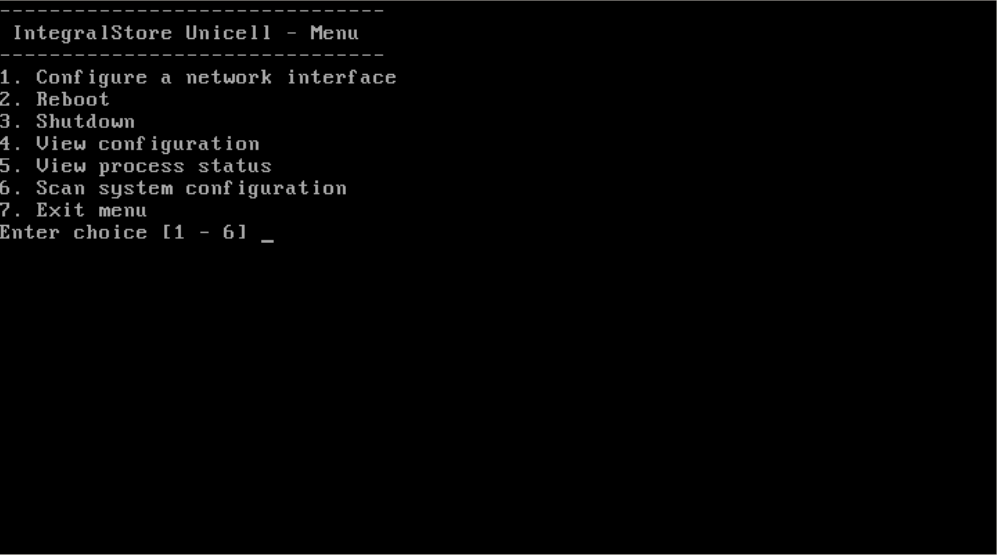

# Network access configuration

Please connect a monitor and a USB keyboard before you power on the system. Once the UNICell system is powered on, the system will boot up and you will see some messages on the monitor as the operating system and the storage software loads. 

At the end of the booting sequence, you will see a menu of options on the monitor(Screen) similar to the Figure A below. Operations performed on this console menu will override any operations that may have been done from IntegralView so please use this menu with caution.

Connect at least one ethernet port to your network before proceeding. Choose the “Configure networking” option from the console menu.

This will take you through a few prompts for basic network configuration.  Select the network settings for the ethernet port to which you have connected the cable. Please note that since it is advisable to use a static IP address for a storage device so that it can be accessible even across reboots.

Once you have configured your IP settings, you will then need to choose the “Scan system configuration” menu option in order for the system to pick up the generate the initial configuration.

Once these two options have been completed, you are now ready to use IntegralView to perform all further operations. 

**It is now advisable to disconnect the keyboard and monitor to prevent unintended access to the console menu.**