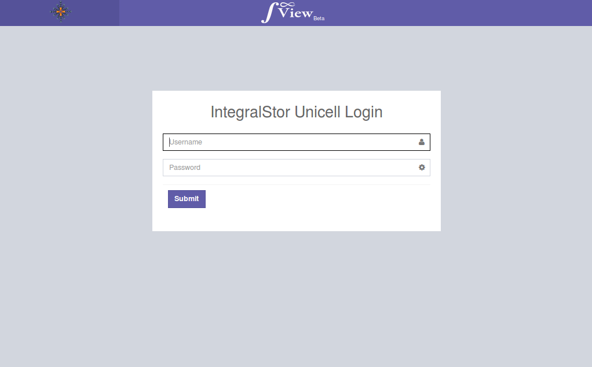
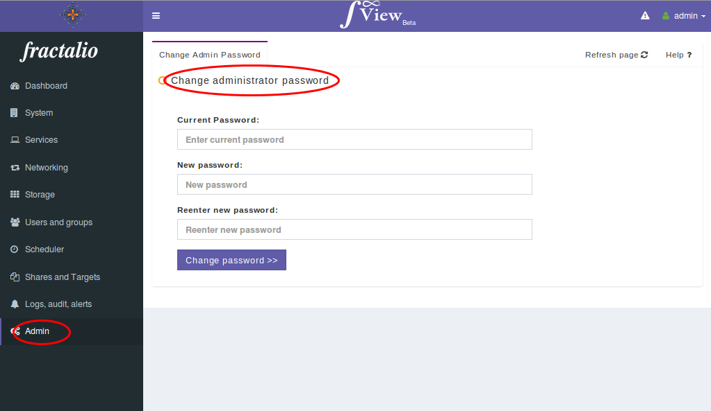

# Accessing IntegralView

Once the steps in the previous section have been completed, you can then point your web browser to the configured IP addres(For example, if you had configured an IP address of 192.168.1.50, please type http://192.168.1.50 in a web browser of your choice like firefox or chromium).

If the networking configuration was done correctly and your computer and the UNICell storage system are on the same network then you should then see a screen similar to below. 

If you do not see this screen then please check the network connectivity from your computer to the UNICell's configure IP address using a tool such as ping.

You will be prompted for a login name and password. 

There are two levels of administrator logins with different privileges. For most common tasks, the admin username called "admin" should be used. The default password for this user is set to “*admin*”. 

There is another administrator login name called "*superadmin*" which gives provides all the functionality of the "*admin*" user plus the ability to remotely reboot the IntegralStor system. 

We advice that you change this password as soon as you login to IntegralView for security purposes.

