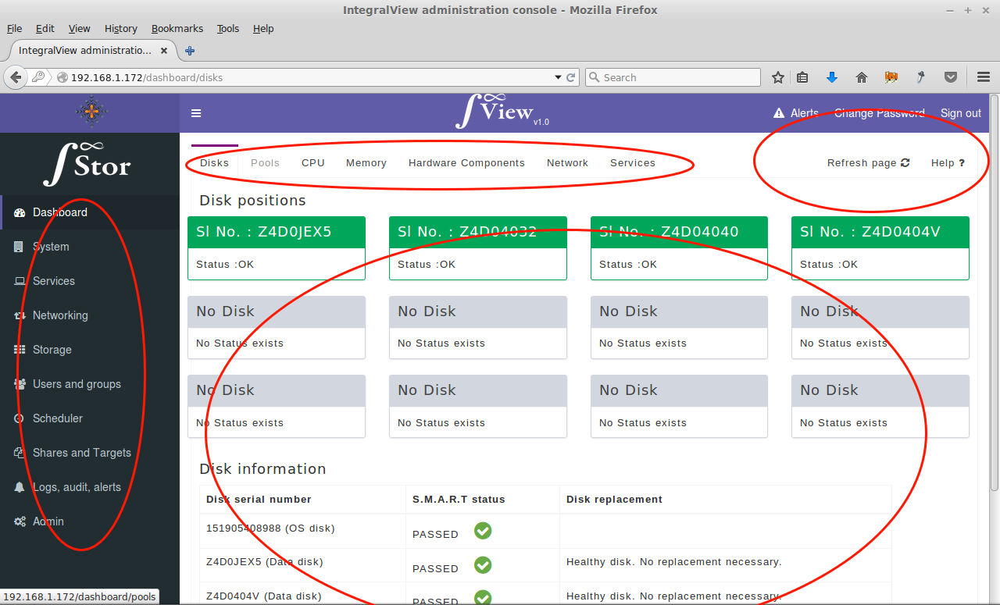

# Getting familiar with IntegralView

IntegralView has been designed to be very intuitive to use but a basic introduction to its layout may help in speeding up this understanding. There are four main areas in IntegralView as depicted in the screen below :

The help/alerts/logout section are visible and accessible from any screen in IntegralView. The “help” link provides context sensitive help that is relevant to the particular screen in use with a brief explanation of its purpose and how to use it. 
The “alerts” icon is normally "!" in colour and this icon changes coulour and flashes to inform you about any new system alerts. You can have a quick view of the new alerts by clicking on the icon. You can logout of IntegralView by clicking on the logout link on the top right hand corner of the screen.

The main category of actions available to you are grouped into the vertically alligned menu options on the left hand side of the screen.  

Clicking on one of these main menu options brings up a set of horizintally alligned sub menu tabs. The options in these tabs correspond to the selected main menu option.

Clicking on a sub menu tab brings up the corresponding configuration screen on the main configuration area. This is where your actual configuration actions will be performed.
